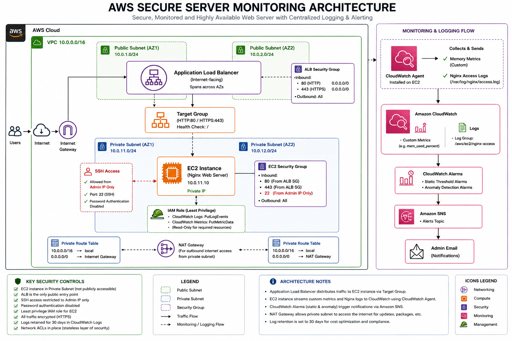

# Secure AWS Web Infrastructure with Automated Monitoring via Terraform (IaC)

A production-ready, highly secure AWS cloud infrastructure deployed entirely via Infrastructure as Code (IaC) using Terraform. This architecture isolates an EC2 Nginx web server within a private subnet, leveraging an Application Load Balancer (ALB) for secure external access, managed securely using IAM roles, and continuously monitored via CloudWatch.

## 🏗️ Architecture Diagram


---

## 🛡️ Key Security Features Implemented

* **Network Isolation (Micro-segmentation):** The EC2 instances hosting the web server are placed entirely within isolated **Private Subnets**. They have no direct exposure to the public internet.
* **Controlled Ingress via ALB:** The web servers are configured via strictly managed **Security Groups** to accept HTTP traffic *only* from the Application Load Balancer's security group, preventing direct internet scans or attacks.
* **Secure Internet Access (Egress Only):** Outbound internet access for the private servers (for package updates and monitoring agents) is handled via a **NAT Gateway** residing in the public subnet.
* **Least Privilege Access (IAM Integration):** The EC2 instances interact with AWS services using an **IAM Instance Profile** with restricted policies, avoiding the highly insecure practice of hardcoding permanent AWS access keys inside the environment.
* **Automated CloudWatch Monitoring:** Utilizes the CloudWatch Agent to securely stream OS-level custom metrics (Memory Utilization) and application logs (`nginx/access.log`) directly to CloudWatch Logs for continuous threat auditing and analysis.

---

## 🛠️ Infrastructure Components

| Component | AWS Resource | Purpose |
| :--- | :--- | :--- |
| **Network** | `aws_vpc` | Custom VPC with a CIDR block of `10.0.0.0/16`. |
| **Subnets** | `aws_subnet` | Public Subnets (for ALB and NAT Gateway) & Private Subnets (for EC2 Compute) mapped across multiple Availability Zones. |
| **Routing** | `aws_route_table` | Public routes directed to the IGW; Private routes securely tunneled through the NAT Gateway. |
| **Compute** | `aws_instance` | Isolated Ubuntu EC2 server bootstrapped to automatically install and run Nginx. |
| **Load Balancer** | `aws_lb` | Application Load Balancer handling secure public ingress and health checks. |
| **IAM Security** | `aws_iam_role` | Strict IAM role allowing EC2 to talk to CloudWatch and SSM securely. |
| **Monitoring** | `aws_cloudwatch_metric_alarm` | Automated SNS alerts triggered instantly upon detecting application errors or high resource limits. |

---

## 🚀 Deployment Guide

### Prerequisites

- Terraform installed locally.
- AWS CLI installed and configured with appropriate IAM credentials.

### Deployment Steps

1. Clone this repository:

```bash
git clone https://github.com/megdad-gasem/aws-secure-web-infrastructure.git
cd aws-secure-web-infrastructure
```

2. Initialize the working directory and download providers:

```bash
terraform init
```

3. Generate and review the execution plan:

```bash
terraform plan
```

4. Deploy the infrastructure to your AWS account:

```bash
terraform apply --auto-approve
```

### Cleanup

To prevent ongoing costs, destroy all provisioned cloud resources:

```bash
terraform destroy --auto-approve
```